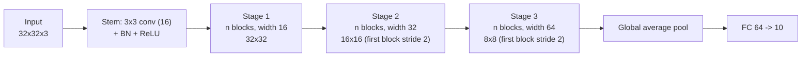
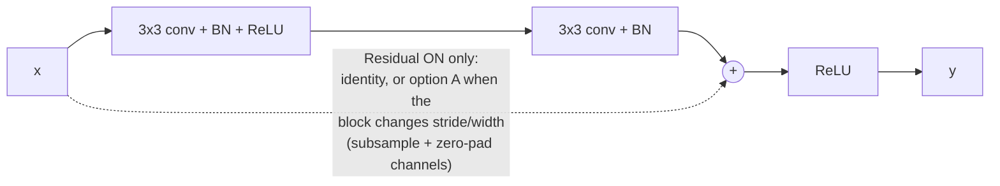
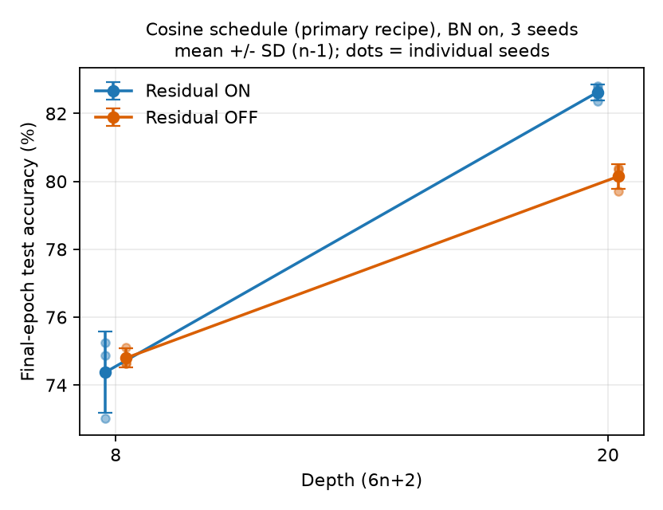
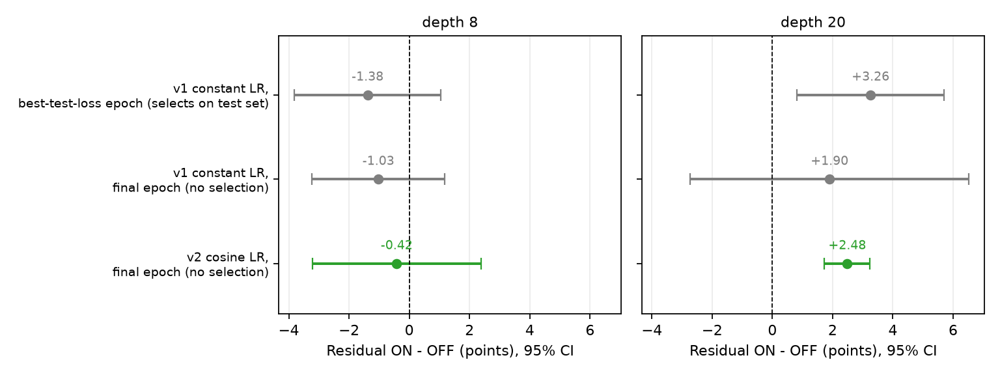
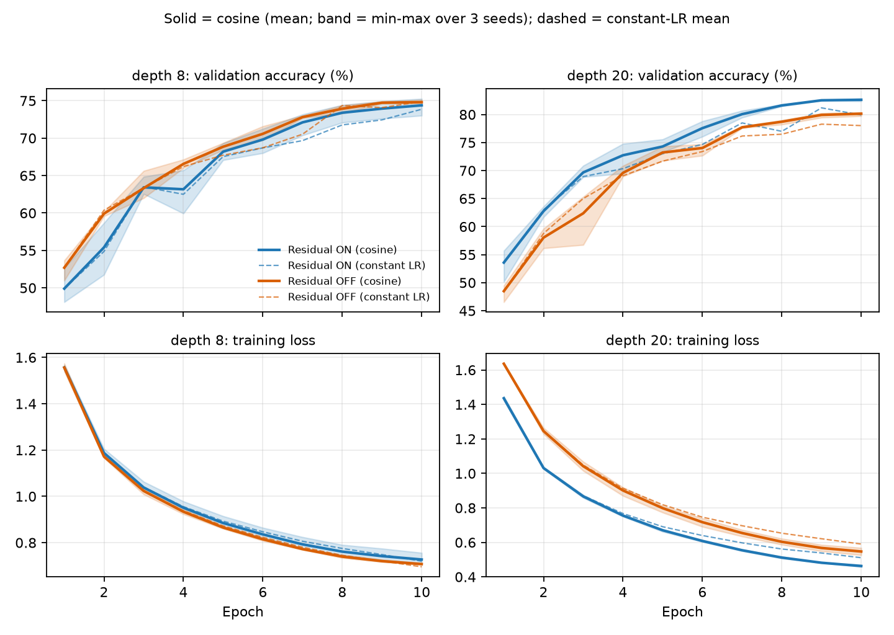
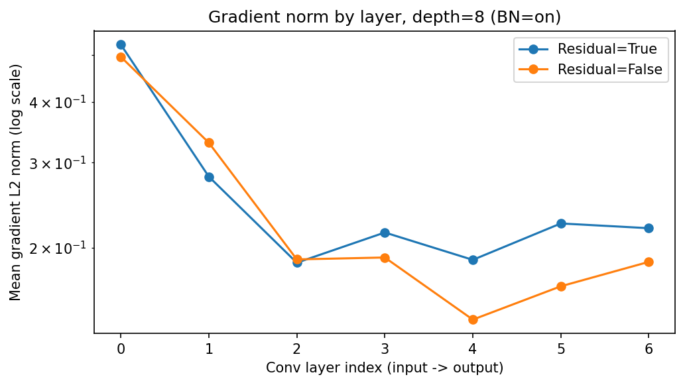
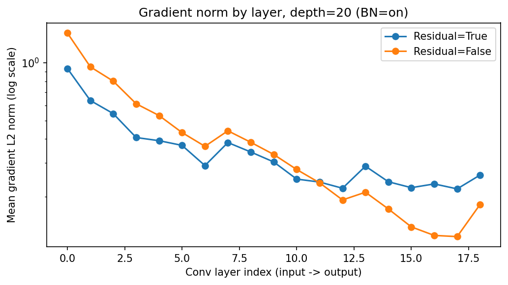

# Does the Value of Residual Connections Depend on Depth? A Parameter-Matched, Multi-Seed Ablation at 8 and 20 Layers on CIFAR-10

## Abstract

Residual connections and batch normalization (BN) are almost always deployed together, and the ablations that isolate the skip connection typically start at depths where optimization difficulty is already expected (18 layers or more); how much a skip connection contributes in the shallower networks that resource-constrained deployments actually use is comparatively uncharacterized. The question arose in our own work from an uncontrolled comparison in a course project, in which two CNNs differing in more than their skip connections reached almost identical CIFAR-10 accuracy (84.88% versus 85.08%, one run each). To turn this into an interpretable measurement, we follow the CIFAR-10 ResNet parameterization of He et al. (depth = 6n + 2) with zero-parameter shortcuts, so that the residual-on and residual-off networks have exactly the same parameter count (75,290 at depth 8; 269,722 at depth 20), keep BN on throughout, and train three seeds per cell for 10 epochs with Adam under two recipes that differ only in the learning-rate schedule. The first recipe (constant learning rate, with the checkpoint chosen by loss on the test set, as in the course code) gives a headline advantage of +3.26 points at depth 20, but that figure depends on selecting the epoch on the test set: the same runs give +1.90 points, with an interval that spans zero, when no epoch is selected, largely because one run's final epoch dips. The second recipe anneals the learning rate (cosine) and reports the accuracy after the final epoch, so that the test set influences no decision. Under it, removing the skip connections has no detectable effect at depth 8 (−0.42 points, 95% CI [−3.22, +2.38], Welch p = 0.61) and costs 2.48 points at depth 20 (95% CI [+1.73, +3.24], p = 0.001); the interaction between depth and the skip connection is significant (F(1, 8) = 14.7, p = 0.005 with pooled variance, p = 0.036 without), a difference-in-differences of +2.90 points. The runs with a constant learning rate had suggested that the depth-20 advantage was a convergence-speed effect that narrows with training; under annealing it does not: the gap stays at 2.3 to 2.9 points over the last four epochs and appears in training loss (0.463 versus 0.547) as well as validation loss, so it is an optimization advantage that survives to the end of a 10-epoch annealed schedule, although whether a plain network would catch up under a much longer schedule remains untested. A per-layer gradient-norm diagnostic shows no early-layer vanishing in either network; the residual network has a flatter cross-layer profile, more so at depth 20. Because the design contains only two depths, BN is never switched off, and three seeds give limited power, we read the result as evidence that the marginal value of a skip connection differs between these two depths, not as a localization of a threshold. Code and raw per-run results are included with this report.

## 1 Introduction

Residual connections (He et al., 2016a) were introduced to address a *degradation problem*: beyond a certain depth, plain networks show higher training error than shallower ones, even though a deeper network could in principle represent whatever its shallower counterpart does by learning identity mappings in the extra layers. In the original study, and in nearly every study since, the "plain" baseline that a residual network is compared with already contains batch normalization (Ioffe & Szegedy, 2015), so the question that is actually answered is whether a skip connection adds value *given that BN is present*; the two techniques are so consistently paired that their separate contributions are rarely disentangled.

Where prior ablations of the skip connection exist, they sit at moderate to large depth. He et al. (2016a) compare plain and residual networks on CIFAR-10 at 20, 32, 44, 56 and 110 layers with identical depth, width and parameter count, and their follow-up analysis of identity mappings (He et al., 2016b) works at 110 layers and beyond. A recent short report (Liu & Goh, 2025) removes the skip connections from an 18-layer ResNet on CIFAR-10 and reports a drop from 89.9% to 86.0% (no repeated runs are reported). Theory, meanwhile, offers reasons to expect little benefit when the nominal depth is small. Veit et al. (2016) show that a ResNet behaves like an ensemble of paths whose *effective* length is far shorter than its nominal depth, and Littwin and Wolf (2016) argue that BN's scale parameters govern how quickly an effectively shallow ensemble grows deeper during training; if a network is already shallow, there is little "compression" for a skip connection to perform. He et al. themselves note, for 18-layer networks on ImageNet, that plain and residual networks end up comparably accurate while the residual network converges faster. What is missing is a depth-resolved, replicated measurement in the shallow regime that keeps parameter count identical and quantifies uncertainty.

The question reached us from a modest source. In a course assignment on CIFAR-10, a six-convolution BN network without skip connections (1.66M parameters) and a BN network with three residual blocks (about 2.86M parameters) reached 85.08% and 84.88% test accuracy, respectively, from a single run each. The comparison is uninterpretable as a statement about skip connections: the two networks differ in width schedule, block structure (the residual network also uses 1×1 projection shortcuts, which add parameters) and parameter count, and a 0.2-point gap from single runs is well inside the range that random initialization alone can produce. It nevertheless raises the question this paper addresses: holding everything else fixed, does a skip connection help, and does the answer depend on depth?

We therefore build a controlled pair of networks that differ *only* in whether the shortcut is present, using the same parameterization as He et al.'s CIFAR-10 experiments, and measure them at a shallow depth (8 layers) and at a depth (20 layers) where He et al. already study plain networks, with three seeds per cell so that the variation across seeds can be estimated. The design is deliberately small: it is the largest version of a fuller plan (BN on/off × residual on/off × several depths × batch sizes) that fit the compute available for this project, and Section 4.1 states exactly what was given up.

The study has two stages, and the second exists because of a weakness in the first. In the first stage we trained under the course code's recipe (constant learning rate; the reported accuracy is that of the epoch with the lowest loss on the test set). Analyzing it, we found that the headline number depended on the selection step, which uses the test set, and that without selection the constant learning rate left the final-epoch accuracy too noisy to detect the effect. Its per-epoch curves also suggested a testable prediction, namely that the depth-20 advantage was a convergence-speed effect that would shrink as training converged. We therefore repeated all twelve runs with a cosine learning-rate schedule and reported the final-epoch accuracy, which involves no selection. We report both stages, because how the estimate moves between them is itself a finding about how fragile such comparisons are.

Our contributions are as follows:

- We measure the effect of removing skip connections at two depths under a protocol in which the residual-on and residual-off networks have identical parameter counts and differ in no other respect, with three seeds per cell, and test the interaction between depth and the skip connection directly rather than comparing two separately tested simple effects. In the final protocol the skip connection has no detectable effect at depth 8 (−0.42 points, p = 0.61) and helps by 2.48 points at depth 20 (95% CI [+1.73, +3.24]); the interaction is significant (p = 0.005 pooled, p = 0.036 unpooled).
- We show how much the estimate depends on the evaluation protocol: the depth-20 effect is +3.26 points when the epoch is selected on the test set, +1.90 when it is not (95% CI [−2.72, +6.52], driven by one run whose final epoch dips, which gives one cell a standard deviation of 2.19 points), and +2.48 under annealing without selection (95% CI [+1.73, +3.24]). Annealing reduces the standard deviation across seeds of the depth-20 cells from 2.19 and 0.99 points to 0.24 and 0.37, so only the annealed protocol yields an interval narrow enough to interpret.
- We test a prediction raised by the first stage and find it unsupported: the depth-20 advantage does not narrow toward zero under annealing. It persists to the final epoch, is present in training loss and validation loss, and is not accompanied by a smaller train–validation gap, so within a 10-epoch budget it is an optimization advantage that is not merely faster early progress.
- We report a per-layer gradient diagnostic whose result is informative in a negative sense: neither network shows early-layer gradient vanishing at these depths, so the data do not support a simple vanishing-gradient explanation; the residual network's gradient profile is flatter across layers, and that is the only difference we observe.

## 2 Related Work

**Residual learning and its ablations.** He et al. (2016a) attribute the difficulty of training deep plain networks to degradation rather than vanishing gradients; they verify that the plain networks, which include BN, keep healthy forward and backward signal norms, and conjecture that the problem is a slower convergence rate. Their CIFAR-10 study uses 6n + 2 layer networks in which "our residual models have exactly the same depth, width, and number of parameters as the plain counterparts", achieved with parameter-free shortcuts, and the shallowest network in it has 20 layers; the plain-network results are presented as training and test curves, and only ResNet-110 is repeated (five runs). The identity-mapping analysis (He et al., 2016b) shows that replacing the identity shortcut with a scaling, gate, dropout or 1×1 convolution hurts a 110-layer network even when the replacement has more parameters, and attributes this to optimization; no experiment there is shallower than 110 layers. Our study uses the network parameterization and parameter-free shortcut design of He et al. (2016a) at 20 layers and extends the comparison to a shallower point (8 layers) and to replicated measurement; its training recipe is far shorter and uses a different optimizer, and it does not attempt to improve on that study in any other respect.

**Fixed-depth ablations of the skip connection in recent work.** Liu and Goh (2025) train a custom 18-layer ResNet on CIFAR-10 with and without skip connections and report 89.9% versus 86.0% test accuracy, together with gradient-magnitude plots in which the no-skip network shows vanishing gradients in early layers. The comparison is at a single depth, appears to be a single run per model, is not exactly parameter-matched (11.2M versus 11.0M parameters), and reports training times that differ by almost an order of magnitude (24 versus 210 minutes) without explanation, which suggests the two runs may not be compute-matched in other respects. It is consistent in sign and rough size with our depth-20 result, and silent about shallower networks. We flag a hazard we encountered in preparing this section: an automatically generated summary of the literature attributed to this report a depth-dependent, dataset-dependent ablation on CIFAR-10, CIFAR-100 and Tiny-ImageNet. Checking the primary sources showed that the report contains no such experiment; the statement comes from Tang et al. (2026), where it describes an ablation of a residual connection inside an analytic, gradient-free federated-learning architecture. We do not treat that result as evidence about backpropagation-trained CNNs, though the possibility that skip-connection effects depend on the dataset is worth testing in the setting studied here (Section Limitations).

**Why BN helps, and how it interacts with residual branches.** Santurkar et al. (2018) show that BN's benefit is not a reduction of internal covariate shift but a smoother, more predictable loss landscape; in their appendix they state that they avoided ResNet architectures because a skip connection seemed to offer similar benefits and would confound the study. De and Smith (2020) show that in a BN residual network the residual branches are downscaled at initialization so that each block is biased toward the identity function, and that an initialization-only substitute (SkipInit) can replace BN in a residual network; every condition in their study, however, retains the skip connections, so the BN-on/residual-off cell is never measured. Both papers thus leave the cell we study, at the depths we study, unmeasured.

**Training residual networks without normalization.** Fixup (Zhang et al., 2019) and a later robust-initialization study (Civitelli et al., 2021) show that residual networks can be trained without BN when the initialization is designed for it; that is the mirror image of our ablation (remove BN, keep the skip). Fixup's appendix contains the only experiment we found that removes all residual branches from a network, at 110 layers and reported as training accuracy over three epochs. Civitelli et al. also report that the choice of shortcut changes the parameter count of a ResNet-50 by about 38% (23.47M versus 38.02M) and that only the larger variant matched the BN baseline, which is the reason we use zero-parameter shortcuts throughout: it prevents a difference in capacity from being mistaken for a difference in topology.

**Competing accounts of why skip connections help.** Veit et al. (2016) unravel a ResNet into 2^n paths and show that, in a 110-layer network, the gradient that reaches the weights during training comes almost entirely from paths far shorter than the network's nominal depth. Littwin and Wolf (2016) place this in a loss-surface analysis in which BN's scale parameters increase during training and thereby increase the effective depth of the ensemble; their only empirical check uses a 10-layer network on a synthetic Gaussian task, without a residual or BN ablation. Orhan and Pitkow (2018) argue that skip connections remove degenerate singularities that slow optimization, and show in fully connected networks that a bias regularizer plus a single BN layer recovers much of the benefit of skip connections. These accounts make different predictions in general, but for a shallow network they agree that the skip connection should contribute little, which is the null that our depth-8 cell tests.

**Re-parameterization and the form of the skip.** RepVGG (Ding et al., 2021) trains multi-branch blocks (3×3, 1×1 and identity, each with its own BN) and folds them into a single convolution for inference; in its ablation on a roughly 28-layer network the identity and 1×1 branches together add 2.75 points on ImageNet with BN present throughout, and the position of BN relative to the addition changes accuracy by more than one point. Oh et al. (2025) propose adding only the component of a block's output that is orthogonal to its input and report gains that are larger for vision transformers than for ResNets. Both are reminders that "with versus without a skip connection" is not a single binary intervention; our blocks use the original post-activation form with identity or option-A shortcuts, and our conclusions are limited to that form.

## 3 Method

We organize this section around the requirement that the residual switch be the *only* difference between the two networks compared.

Figure 1: The network (top) and the block (bottom). Depth = 1 stem convolution + 3 stages × n blocks × 2 convolutions + 1 fully connected layer = 6n + 2. In the residual-off network the dashed path and the addition are removed and nothing else changes.

### 3.1 Design principles

Four choices follow from the requirement above. (i) BN is fixed on in every run, so the comparison is "skip connection given BN". (ii) Shortcuts contribute no parameters: when a block keeps its width and stride the shortcut is the identity, and when it doubles the width and halves the resolution the shortcut subsamples the input with stride 2 and pads the extra channels with zeros ("option A" in He et al., 2016a). Consequently the residual-on and residual-off networks have *exactly* the same parameters, not merely similar counts. (iii) We use He et al.'s CIFAR-10 parameterization (three stages of widths 16, 32, 64; global average pooling; a single fully connected classifier; no dropout) so that results are comparable to a published reference point. (iv) Everything else (initialization, optimizer, schedule, augmentation, batch size, seeds) is identical across the two networks.

### 3.2 Architecture

A block applies a 3×3 convolution, BN, ReLU, a second 3×3 convolution and BN; in the residual-on network the shortcut is added and a ReLU follows, and in the residual-off network the ReLU follows the second BN directly. Convolutions carry no bias when followed by BN. Weights are initialized with He normal initialization in fan-out mode (He et al., 2015) and BN scale and shift parameters with one and zero. With n = 1 the network has 8 layers and 75,290 parameters, and with n = 3 it has 20 layers and 269,722 parameters; both counts are identical in the residual-on and residual-off networks, which we verify programmatically, and the second matches the 0.27M parameters reported for ResNet-20 by He et al. (2016a).

### 3.3 Training protocol, learning-rate schedules and reproducibility

Each run sets the Python, NumPy and PyTorch (CPU and CUDA) random seeds before building the model, so the seed determines the weight initialization, and passes a seeded generator to the training data loader, so it also determines the order in which examples are presented; cuDNN is set to deterministic mode. Runs are executed by a loop that appends every finished run to a JSON file and skips combinations already present in that file, so an interrupted session resumes without repeating work.

The learning-rate schedule is a switch. Under `constant` the learning rate is 1e-3 throughout, and the epoch reported is the one with the lowest loss on the test set (the convention inherited from the course code, described in Section 4.3). Under `cosine` the learning rate is annealed once per epoch by cosine annealing without restarts (Loshchilov & Hutter, 2017) with the period equal to the ten training epochs, so that it takes the values 1.0e-3, 9.8e-4, 9.1e-4, 7.9e-4, 6.5e-4, 5.0e-4, 3.5e-4, 2.1e-4, 9.5e-5 and 2.4e-5 in epochs 1 to 10, and the reported accuracy is that after the final epoch. Because the learning rate in the first epoch is 1e-3 under both, and the seed fixes initialization and data order, epoch 1 must be numerically identical under the two recipes for every run; Section 5.5 checks this, which verifies that initialization, data order and training code are identical across the recipes up to the first change of learning rate.

### 3.4 Diagnostics

Besides test accuracy we record, for every run and epoch, training loss, training accuracy, validation loss and validation accuracy (the last two are computed on the test set; see Section 4.3). We also measure, for each network at each depth and for the seed 2026 only, the L2 norm of the gradient of every convolution weight tensor, averaged over the first 50 optimizer steps of training at the constant learning rate of 1e-3. This diagnostic therefore does not depend on the schedule. It is a lightweight stand-in for the loss-landscape diagnostics of Santurkar et al. (2018), and its limitations are discussed in Section 5.4.

## 4 Experimental Setup

### 4.1 Design and scope decision

Table 1 lists the twenty-four runs. The design is the reduced form of a larger plan that would have crossed BN on/off, residual on/off, five depths and a range of batch sizes with five or more seeds (on the order of a hundred training runs, more than the available compute allowed). We kept the comparison that we judged most informative given the literature reviewed in Section 2, the effect of the skip connection when BN is present, at two depths, and gave up three things: the BN-off arm (so nothing here speaks to how much of the effect depends on BN), the intermediate depths (so no curve can be drawn, only two points compared), and larger seed counts.

**Table 1: The runs. Each row is repeated under both learning-rate schedules (12 runs per schedule, 24 in total).**

| Depth (6n + 2) | n | Parameters | Residual | Seeds | Runs per schedule |
|---|---|---|---|---|---|
| 8 | 1 | 75,290 | ON, OFF | 2026, 2027, 2028 | 6 |
| 20 | 3 | 269,722 | ON, OFF | 2026, 2027, 2028 | 6 |

### 4.2 Training configuration

CIFAR-10 (Krizhevsky, 2009) with its standard 50,000/10,000 split; per-channel mean and standard-deviation normalization; random 32×32 crops from images padded by 4 pixels and random horizontal flips for training. Adam (Kingma & Ba, 2015) with initial learning rate 0.001, weight decay 1e-4 applied as L2 regularization, batch size 64, 10 epochs, cross-entropy loss, no dropout, under either the constant or the cosine schedule of Section 3.3. Experiments were run in PyTorch on a single GPU on Google Colab. Only these two recipes were run; no other recipe was tried and discarded.

### 4.3 Evaluation protocol and its caveats

We list the properties of the evaluation that a reader needs in order to interpret the numbers, including those that weaken them.

*The test set was the model-selection set in the first stage.* The training code inherited from the course assignment evaluates on the 10,000 CIFAR-10 test images after every epoch, keeps the checkpoint with the lowest loss on those images, and the accuracy it reports is that of the checkpoint on the same images. There is no held-out validation split. Selecting an epoch on the evaluation data makes absolute accuracies optimistic, and it can favor noisier training curves, because the minimum of a noisier sequence is lower. He et al. (2016a), by contrast, fixed their schedule on a 45k/5k training/validation split. We call this the *legacy* metric, and Section 5.2 examines how much the comparison depends on it.

*The final protocol selects nothing.* Under the cosine schedule the reported number is the accuracy after the last epoch. The epoch count, learning rate and schedule are fixed in advance, so within a run no decision depends on the test set (per-epoch test accuracy is logged for the learning curves, but it drives no choice). Two caveats apply. The decision to try an annealed schedule was made after inspecting the test-set curves of the first stage, which is a mild researcher degree of freedom; the same recipe is used for both arms, no hyperparameter was tuned per arm or per depth, and only two recipes were run. And because no held-out validation set exists, the hyperparameters themselves (learning rate 1e-3, weight decay 1e-4, 10 epochs) are inherited from the course assignment rather than chosen on validation data.

*Accuracy is a mean of per-batch accuracies.* The helper functions average per-batch accuracy over the 157 evaluation batches (the last batch has 16 images), which weights the last batch slightly more than a global count of correct predictions over all images would; the difference is at most a few tenths of a point and is the same for every run.

*Statistics with three seeds.* We report means and sample standard deviations (denominator n − 1); the notebook that produced the runs prints population standard deviations, which are smaller by a factor of about 0.82 in some printouts. Simple effects are tested with Welch's t-test, which with three observations per group has very few degrees of freedom, and we also report an exact permutation test, whose smallest attainable two-sided p-value with three versus three observations is 0.10. The interaction is tested with a two-way ANOVA on the balanced 2×2 design (four cells, three replicates, 8 residual degrees of freedom), which assumes equal variances across cells, and, because that assumption is doubtful here, also with an unpooled (Welch–Satterthwaite) test of the difference-in-differences.

### 4.4 Implementation

The runs were executed from a single notebook on Google Colab with results, checkpoints and figures written to Google Drive. The per-run JSON records contain the per-epoch curves used in Section 5, so every number below can be recomputed from them.

## 5 Results and Analysis

### 5.1 Main results

**Table 2: Final-epoch test accuracy (%) under the cosine schedule (primary protocol), by depth and residual connection.**

| Depth | Residual | Seed 2026 | Seed 2027 | Seed 2028 | Mean | SD (n − 1) |
|---|---|---|---|---|---|---|
| 8 | ON | 75.26 | 74.87 | 73.01 | 74.38 | 1.20 |
| 8 | OFF | 75.12 | 74.63 | 74.64 | 74.80 | 0.28 |
| 20 | ON | 82.36 | 82.71 | 82.81 | 82.63 | 0.24 |
| 20 | OFF | 79.72 | 80.33 | 80.38 | 80.15 | 0.37 |

At depth 8 the residual-on network is 0.42 points *below* the residual-off network on average, with a 95% confidence interval of [−3.22, +2.38] (Welch t = −0.59, df = 2.2, p = 0.61; exact permutation p = 0.90). There is no detectable effect of the skip connection at this depth; the interval is wide, mainly because one residual-on run (seed 2028, 73.01%) is well below the others, and it does not exclude effects of two to three points in either direction. At depth 20 the residual-on network is 2.48 points *above* (95% CI [+1.73, +3.24]; Welch t = 9.79, df = 3.4, p = 0.0013; exact permutation p = 0.10, the smallest value attainable with three seeds per group). All three residual-on seeds (82.36 to 82.81) exceed all three residual-off seeds (79.72 to 80.38).

The hypothesis of interest is that the effect depends on depth, and this is tested by the interaction: F(1, 8) = 14.73, p = 0.0050 with a pooled error term, with a difference-in-differences of +2.90 points (95% CI [+1.16, +4.65]). The four cell variances range from 0.06 to 1.45, and the pooled error term is dominated by the depth-8 residual-on cell, so we also test the difference-in-differences without pooling: t = 3.84, df = 2.8, p = 0.036, 95% CI [+0.39, +5.42]. The conclusion that the effect differs between the depths therefore holds under both, with a wide interval under the more conservative test. The main effect of the skip connection averaged over depths is also significant here (F(1, 8) = 7.47, p = 0.026), but it is driven entirely by depth 20 and should not be read as a general effect. With three seeds the exact permutation test cannot reach conventional significance, so we weight the consistency of the direction across the analyses below more heavily than any single p-value.

Figure 2: Final-epoch test accuracy by depth and residual connection under the cosine schedule (BN on). Error bars are sample standard deviations over three seeds; dots are the individual seeds. The lines join two points only and do not indicate the shape of the relationship between them.

### 5.2 How much the conclusion depends on the evaluation protocol

The same twelve-run design was executed under two recipes, and Table 3 shows what each says. The first row is the legacy metric of the stage with a constant learning rate; the second is the accuracy after the final epoch of the same runs (no selection); the third is the primary protocol.

**Table 3: Effect of the skip connection (Residual ON − OFF, points, with 95% CI) under three protocols.**

| Protocol | Depth 8 | Depth 20 | Interaction (difference-in-differences; pooled ANOVA p) |
|---|---|---|---|
| Constant LR, best-test-loss epoch (legacy; selects on the test set) | −1.38 [−3.81, +1.04] | +3.26 [+0.81, +5.70] | +4.64; p = 0.002 |
| Constant LR, final epoch (no selection) | −1.03 [−3.23, +1.18] | +1.90 [−2.72, +6.52] | +2.92; p = 0.10 |
| Cosine LR, final epoch (no selection; primary) | −0.42 [−3.22, +2.38] | +2.48 [+1.73, +3.24] | +2.90; p = 0.005 |

Figure 3: The estimated effect of the skip connection and its 95% confidence interval under the three protocols of Table 3, at depth 8 (left) and depth 20 (right).

Three things follow. First, the legacy figure is the most favorable of the three for the depth-20 effect: +3.26 points, against +1.90 for the same runs without selection and +2.48 under the primary protocol; it also gives the most negative depth-8 estimate (−1.38, against −1.03 and −0.42). The 1.4-point gap between the first two rows comes almost entirely from one run: the depth-20 residual-on run with seed 2028 has legacy accuracy 81.32% but 77.39% after the final epoch, whereas the other five runs in the two depth-20 cells differ between the two metrics by at most 0.2 points. Selection bias and the noise of a single final epoch therefore cannot be separated with these data. What can be said is that the legacy number depends on a choice driven by the test set; that the residual-on curves are the noisier ones (their mean change in validation accuracy from one epoch to the next at depth 20 is 4.0 points against 3.4 for residual-off), which is the condition under which picking the epoch with the lowest test loss favors one arm; and that the legacy figure should not be quoted in isolation. Second, without selection but with a constant learning rate the estimate is too noisy to be informative: the depth-20 residual-on cell has a standard deviation of 2.19 points, because that same seed drops to 77.39% in the last epoch, and the interval for the depth-20 effect spans −2.72 to +6.52. Third, annealing repairs this: the standard deviations of the depth-20 cells fall to 0.24 and 0.37 points and the change in validation accuracy from one epoch to the next over the last three epochs falls from 1.0–2.8 points to 0.7–0.9 points. Under annealing the legacy and final-epoch metrics coincide, since eleven of the twelve runs reach their lowest test loss at the last epoch, so the selection problem disappears by construction.

Annealing improves every cell but not equally (Table 4): the deeper networks gain about 2 to 2.7 points, the depth-8 networks essentially nothing (+0.5 and −0.1), consistent with the depth-8 networks being closer to converged at 10 epochs.

**Table 4: Final-epoch accuracy (%), mean ± SD (n − 1) over three seeds, by learning-rate schedule.**

| Depth | Residual | Constant LR | Cosine LR | Change |
|---|---|---|---|---|
| 8 | ON | 73.86 ± 1.04 | 74.38 ± 1.20 | +0.52 |
| 8 | OFF | 74.88 ± 0.86 | 74.80 ± 0.28 | −0.08 |
| 20 | ON | 79.92 ± 2.19 | 82.63 ± 0.24 | +2.71 |
| 20 | OFF | 78.02 ± 0.99 | 80.15 ± 0.37 | +2.12 |

### 5.3 Where the depth-20 advantage comes from

Figure 4: Mean validation accuracy (top) and training loss (bottom) per epoch at depth 8 (left) and depth 20 (right). Solid lines are the cosine runs (bands are the minimum–maximum across the three seeds); dashed lines are the means under the constant learning rate.

The runs with a constant learning rate showed a depth-20 gap that was large in the first epochs (+5.1 points after the first) and smaller later (0.5 to 2.9 points over the last three epochs), and this suggested that the advantage was largely a matter of speed and might vanish with more training. Under annealing that prediction is not borne out. The per-epoch gap in mean validation accuracy at depth 20 is +5.1, +4.7, +7.3, +3.1, +1.1, +3.5, +2.3, +2.9, +2.6 and +2.5 points, so it is largest early but stabilizes at 2.3 to 2.9 points over the last four epochs rather than closing. The advantage is also visible in the losses at the end of training: the final training loss is 0.463 with the skip connection against 0.547 without (difference −0.084, 95% CI [−0.131, −0.037], p = 0.014), and the final validation loss is 0.507 against 0.574 (difference −0.068, 95% CI [−0.096, −0.039], p = 0.009). At depth 8 the corresponding differences are small and not distinguishable from zero (training loss +0.020, p = 0.31; validation loss +0.024, p = 0.33).

The skip connection does not reduce the gap between training and validation accuracy. At the last epoch that gap is 1.4 points with and 1.0 points without at depth 20, and 0.2 points with and 0.5 points without at depth 8 (training accuracy here is the running average over the epoch, computed with augmentation and BN in training mode, and is used only to compare the two networks). Together these indicate an advantage in how well the network fits, which persists to the end of a 10-epoch annealed schedule, rather than one in generalization. This is compatible with He et al.'s (2016a) account of residual connections as easing optimization, but it differs from the observation in that paper for 18-layer networks on ImageNet that the two end at comparable accuracy: at 20 layers on CIFAR-10, within our budget, they do not (the datasets, depths and budgets differ, so this is a contrast rather than a contradiction).

One feature at depth 8 is not explained. The residual-off network is ahead by several points in the early epochs under both recipes (gaps of −2.8, −4.5 and −3.4 points in epochs 1, 2 and 4 under cosine, and −2.8, −5.5 and −3.7 under the constant rate), and the gap closes to −0.4 points by the last epoch under cosine. So at shallow depth the plain network is faster early and the two arrive at the same place; we did not investigate why.

The epoch counts here are small. Ten epochs of an annealed schedule are far from a converged CIFAR-10 recipe (Section 5.6), and the persistence of the advantage under annealing rules out only the simplest form of the convergence-speed explanation, namely that the gap would close as soon as the learning rate is annealed within the same budget. It does not show that a plain network would never catch up.

### 5.4 Gradient diagnostic

Figure 5: Mean L2 norm of the gradient of each convolution weight tensor (log scale), from input (left) to output (right), for the residual-on and residual-off networks at depth 8 (a; 7 convolutions) and depth 20 (b; 19 convolutions). Seed 2026 only; averaged over the first 50 optimizer steps at the constant learning rate.

We report what the diagnostic shows and what it does not. In both networks at both depths the gradient norm is *largest near the input and smaller toward the output*: there is no early-layer vanishing in either arm, so this measurement does not display the signature usually associated with the degradation of deep plain networks, and it differs from the strong early-layer vanishing that Liu and Goh (2025) show for their no-skip ResNet-18 (a different network, framework and measurement). The residual network's profile is flatter. Reading the figures, the ratio between the largest and smallest per-layer norm is roughly 3 (residual ON) versus 4 (OFF) at depth 8, and roughly 4 versus 10 at depth 20; in the first half of the depth-20 network the residual-off gradients are somewhat larger, and in the last third the residual-on gradients are larger by up to about 1.7×. These ratios are approximate because they were read from the figures: the raw per-layer values were not saved.

The diagnostic is weak evidence for four reasons: it uses a single seed with no variability estimate; it averages over the first 50 optimizer steps rather than measuring the network at initialization; with BN the norm of a weight gradient scales inversely with the norm of the weight, so raw norms are a crude proxy for how well signal propagates; and it measures weight gradients only. What it supports is that the skip connection makes the gradient scale more uniform across adjacent layers, and slightly more so at depth 20 than at depth 8. It does not support a picture in which the plain network's early layers are starved of gradient, and it does not discriminate among the accounts in Section 2, all of which are compatible with a flatter profile.

### 5.5 Reproducibility and data-integrity checks

Three checks were made. First, the two recipes must agree in epoch 1, since the learning rate is 1e-3 under both and the seed fixes initialization and data order. Across all twelve matched runs the maximum absolute difference in epoch-1 training loss, validation loss and validation accuracy between the results under the constant learning rate and under the cosine schedule is exactly zero, although the cosine runs were executed later than the runs with a constant learning rate. This shows that initialization, data order and training code are identical across the two recipes up to the first change of learning rate, and that the pipeline reproduces exactly between the two executions.

Second, in the first stage one entry (depth 8, residual ON, seed 2027) matched the corresponding entry of an earlier, superseded 8-epoch pilot to sixteen digits, which raised the possibility that a stale pilot record had been carried into the results file by the resume logic. We deleted that entry and re-ran the cell; it reproduced the same accuracy, loss and best epoch exactly, which is what a deterministic pipeline should do, and means the value is correct whether or not the earlier entry was a carried-over record. The pilot file is not used in any analysis.

Third, in the first stage two seeds in the depth-20 residual-on cell have identical legacy accuracy (0.8126990…) but different test loss (0.537 versus 0.546) and different best epochs (10 versus 9), so they are different runs whose per-batch correct counts happen to coincide. It contributed to the very small variance of that legacy cell (SD 0.03), and it is one reason we do not rely on that cell's variance; under the primary protocol the depth-20 cells have standard deviations of 0.24 and 0.37 points with no such coincidence.

### 5.6 Relation to prior work

Our depth-20 network has 269,722 parameters, matching the 0.27M that He et al. (2016a) report for ResNet-20, and reaches 82.6% under the primary protocol against their 91.25% (8.75% error). The gap is expected from the training budget: they train for 64k iterations at batch size 128 (on the order of 180 epochs over their 45k-image training split) with SGD, momentum and a stepwise learning-rate decay, whereas we train for 10 epochs with Adam, and we treat the comparison as a plausibility check on the implementation rather than a reproduction. The 2.5-point advantage at depth 20 is in the same direction as, and somewhat smaller than, the 3.9-point difference that Liu and Goh (2025) report at 18 layers, despite a roughly forty-fold difference in parameter count and different training recipes. The absence of a detectable effect at depth 8 is what the effective-path accounts (Veit et al., 2016; Littwin & Wolf, 2016) would lead one to expect for a shallow network; none of them predicts an advantage for the plain network, and our data do not establish one (the final-epoch difference is −0.4 points with an interval of ±2.8), although the plain network's early lead at depth 8 (Section 5.3) is a pattern we can describe but not explain. A possible contributor is that in post-activation blocks the identity path passes through a ReLU after each addition, so it is not a clean identity (He et al., 2016b); we did not test this.

## 6 Conclusion

Under a protocol in which the residual-on and residual-off networks differ only in the presence of parameter-free shortcuts, BN is on, and three seeds are run per cell, removing the skip connection has no detectable effect on CIFAR-10 accuracy at 8 layers (−0.4 points, interval [−3.2, +2.4]) and costs about 2.5 points at 20 layers (interval [+1.7, +3.2]), after 10 epochs with an annealed learning rate and no checkpoint selection; the interaction between depth and the skip connection is significant (p = 0.005 pooled, 0.036 unpooled). The advantage at 20 layers is an optimization effect, visible in training and validation loss, that persists to the end of the annealed schedule rather than closing, which contradicts the expectation from the runs with a constant learning rate that it was only a matter of early speed. The comparison is also a cautionary example: the estimate of the depth-20 effect ranged from +1.90 to +3.26 points across three evaluation protocols applied to the same design, and only the annealed protocol without selection gave an interval narrow enough to interpret. A gradient-norm diagnostic shows a flatter layer-wise profile with skip connections but no vanishing gradients in either network. The result is a statement about two depths and one training budget; it locates no threshold and says nothing about the BN-off condition, and the limitations below bound how far it should be extended.

## Limitations

The study compares two depths, which supports the claim that the effect differs between them but not any claim about its shape: the straight line in Figure 2 joins two points, and we cannot say where between 8 and 20 layers the effect appears, whether it grows monotonically, or whether it changes at greater depth. Densifying the depth axis with the same replication is the most direct extension, and would allow the interaction to be tested against alternative functional forms.

BN was never switched off. The design answers whether a skip connection matters *given BN*, and cannot say how much of the depth-20 advantage depends on BN's presence, nor whether BN alone accounts for training stability at shallow depth, which was the original motivation. Restoring the BN-on/off arm would turn the design into the full 2×2 factorial that the interaction analysis was built for. A related axis that we did not test is batch size: BN degrades sharply at small batch sizes (Wu & He, 2018), so whether the skip connection matters more when BN is unreliable is an open question in the same setting.

Statistical power is limited. Three seeds per cell give an interval of roughly ±2.8 points for the depth-8 effect, so effects of two to three points in either direction cannot be excluded there; the smallest attainable exact permutation p-value is 0.10; the parametric test of the depth-20 simple effect rests on about three degrees of freedom; and the cell variances are unequal (0.06 to 1.45), with the pooled error term dominated by the depth-8 residual-on cell, which is why the interaction p-value ranges from 0.005 to 0.036 depending on whether variances are pooled. Future work should use five or more seeds per cell, under both learning-rate recipes so that they stay matched, so that the intervals are tighter and the assumptions of the tests can be checked.

The evaluation protocol has weaknesses that the second stage reduces but does not remove. The primary protocol selects no epoch, so the test set does not influence any decision within a run, but there is still no held-out validation set: the hyperparameters (learning rate, weight decay, 10 epochs) were inherited rather than chosen on validation data, they were not tuned separately for the two arms or the two depths (which could favor either arm), and the decision to try an annealed schedule followed inspection of the first stage's test-set curves. A design with a held-out validation split of the training set, with the recipe fixed before any test-set result is seen, would remove these concerns. The legacy metric used in the first stage depends on a choice driven by the test set, is likely optimistic, and should not be quoted in isolation.

The training budget is short. Even with annealing, ten epochs is roughly one-eighteenth of the schedule of He et al. (2016a), and accuracy at depth 20 is 8.6 points below theirs, so no network here is converged. The persistence of the depth-20 advantage under annealing rules out the simplest convergence-speed explanation but does not show that the advantage would remain under a much longer schedule; that requires runs of 30 to 100 epochs or more.

The gradient diagnostic is a single seed, averaged over the first 50 optimizer steps at a constant learning rate, restricted to convolution weights, and its raw values were not saved, so the layer-wise ratios quoted in Section 5.4 were read from the figures. Stronger diagnostics would use several seeds with variability estimates, measure the network at initialization and along training, and use the gradient-predictiveness and smoothness measures of Santurkar et al. (2018) or the analysis of effective path length in Veit et al. (2016), which would also allow the competing accounts in Section 2 to be distinguished rather than merely shown to be compatible.

The architecture family is narrow. All blocks are post-activation, shortcuts are identity or option-A, widths are small (16–64), the head is global average pooling with a single linear layer, and optimization is Adam with coupled L2 decay; the conclusions may not transfer to pre-activation blocks (He et al., 2016b), projection shortcuts, wider networks, SGD with momentum, or other forms of the skip such as re-parameterized or orthogonal updates (Ding et al., 2021; Oh et al., 2025). We also use a single dataset. The dataset dependence of skip-connection effects that Tang et al. (2026) report for their analytic architecture is untested here, and CIFAR-100 or Tiny-ImageNet would be the natural datasets on which to test it in a backpropagation-trained CNN.

Finally, we note the provenance of three things so that readers can weigh them. The question originated in an uncontrolled comparison from a course project (Section 1). The initial framing of this study leaned on a dataset-dependent depth ablation that a secondary summary attributed to Liu and Goh (2025); reading the primary sources showed that attribution to be wrong (Section 2), and the motivation in this paper was rebuilt on what the primary sources actually contain. And the second stage was added because analysis of the first showed its protocol to be flawed; our expectation at that point, that the depth-20 advantage would narrow under annealing, was wrong, and we report the result that contradicts it. The twelve works from which we take specific claims were read in full text; Liu and Goh (2025) was read in full and Tang et al. (2026) at the relevant ablation passage; the standard references for BN, Adam, He initialization, cosine annealing and CIFAR-10 are cited for their definitions only.

## References

Civitelli, E., Sortino, A., Lapucci, M., Bagattini, F., & Galvan, G. A Robust Initialization of Residual Blocks for Effective ResNet Training without Batch Normalization. arXiv:2112.12299, 2021.

De, S., & Smith, S. L. Batch Normalization Biases Residual Blocks Towards the Identity Function in Deep Networks. *NeurIPS 2020*. arXiv:2002.10444.

Ding, X., Zhang, X., Ma, N., Han, J., Ding, G., & Sun, J. RepVGG: Making VGG-style ConvNets Great Again. *CVPR 2021*. arXiv:2101.03697.

He, K., Zhang, X., Ren, S., & Sun, J. Delving Deep into Rectifiers: Surpassing Human-Level Performance on ImageNet Classification. *ICCV 2015*. arXiv:1502.01852.

He, K., Zhang, X., Ren, S., & Sun, J. Deep Residual Learning for Image Recognition. *CVPR 2016a*. arXiv:1512.03385.

He, K., Zhang, X., Ren, S., & Sun, J. Identity Mappings in Deep Residual Networks. *ECCV 2016b*. arXiv:1603.05027.

Ioffe, S., & Szegedy, C. Batch Normalization: Accelerating Deep Network Training by Reducing Internal Covariate Shift. *ICML 2015*. arXiv:1502.03167.

Kingma, D. P., & Ba, J. Adam: A Method for Stochastic Optimization. *ICLR 2015*. arXiv:1412.6980.

Krizhevsky, A. Learning Multiple Layers of Features from Tiny Images. Technical report, University of Toronto, 2009.

Littwin, E., & Wolf, L. The Loss Surface of Residual Networks: Ensembles and the Role of Batch Normalization. arXiv:1611.02525, 2016.

Liu, X., & Goh, K. M. ResNet: Enabling Deep Convolutional Neural Networks through Residual Learning. arXiv:2510.24036, 2025.

Loshchilov, I., & Hutter, F. SGDR: Stochastic Gradient Descent with Warm Restarts. *ICLR 2017*. arXiv:1608.03983.

Oh, G., Cho, W., Kim, S., Choi, S., & Yu, Y. Revisiting Residual Connections: Orthogonal Updates for Stable and Efficient Deep Networks. *NeurIPS 2025*. arXiv:2505.11881.

Orhan, A. E., & Pitkow, X. Skip Connections Eliminate Singularities. *ICLR 2018*. arXiv:1701.09175.

Santurkar, S., Tsipras, D., Ilyas, A., & Madry, A. How Does Batch Normalization Help Optimization? *NeurIPS 2018*. arXiv:1805.11604.

Tang, J., Huang, Y., Fan, K., Han, F., Li, J., Xu, J., He, R., Liu, A., Song, H. H., Zhuang, H., & Liu, Y. DeepAFL: Deep Analytic Federated Learning. *ICLR 2026*. arXiv:2603.00579.

Veit, A., Wilber, M., & Belongie, S. Residual Networks Behave Like Ensembles of Relatively Shallow Networks. *NeurIPS 2016*. arXiv:1605.06431.

Wu, Y., & He, K. Group Normalization. *ECCV 2018*. arXiv:1803.08494.

Zhang, H., Dauphin, Y. N., & Ma, T. Fixup Initialization: Residual Learning Without Normalization. *ICLR 2019*. arXiv:1901.09321.
